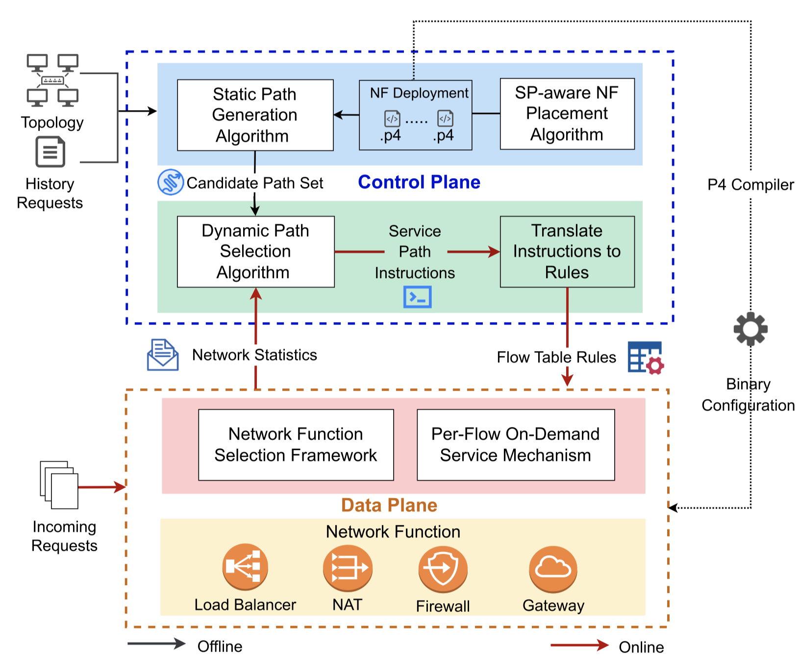

# FlexNF: Flexible Network Function Orchestration for Scalable On-Path Service Chain Serving

## Introduction
Programmable Data Plane (PDP) has been leveraged to offload Network Functions (NFs). Due to its high processing capability, the PDP improves the performance of NFs by more than one order of magnitude. However, the coarse-grained NF orchestration on the PDP makes it hard to fulfill the dynamic service chain demands and unreasonable network function deployment causes long end-to-end delays. In this paper, we propose the Flexible Network Function (FlexNF) deployment on the PDP. First, we design an NF Selection Framework, leveraging the service selection label and re-entering operations for flexible NF orchestration. Second, to support runtime NF reconfiguration to meet the dynamic flow demands, we propose the Per-Flow On-Demand servicing mechanism, where one Match-Action Table with multiple mixed NFs works as different NFs for different flows. Third, to ensure the QoS of flows, on the one hand, we design an SP-aware NF Placement Algorithm to find a near-optimal placement solution that accommodates peak traffic volume while minimizing the overall routing path lengths of all the requests, on the other hand, we design a Two-Stage Service Path Construction Algorithm to provide on-path service while considering load balancing. We implement 15 types of network functions on the P4 switch, based on which we construct the comprehensive experiments. FlexNF reduces the traffic delay by 42.6% while increasing the service chain acceptance rate by five times compared with current solutions. Besides, when switching functions, the FlexNF improves the throughput by 2.04Gbps and reduces the packet loss by 8.269% compared with current solutions.




## Citation

```bibtex
@article{xiao2023flexnf,
  title={FlexNF: Flexible Network Function Orchestration for Scalable On-Path Service Chain Serving},
  author={Xiao, Jingyu and Zuo, Xudong and Li, Qing and Zhao, Dan and Zhao, Hanyu and Jiang, Yong and Sun, Jiyong and Chen, Bin and Liang, Yong and Li, Jie},
  journal={IEEE/ACM Transactions on Networking},
  year={2023},
  publisher={IEEE}
}

@inproceedings{zhao2021flexnf,
  title={FlexNF: Flexible network function orchestration on the programmable data plane},
  author={Zhao, Hanyu and Li, Qing and Duan, Jingpu and Jiang, Yong and Liu, Kai},
  booktitle={2021 IEEE/ACM 29th International Symposium on Quality of Service (IWQOS)},
  pages={1--6},
  year={2021},
  organization={IEEE}
}
```